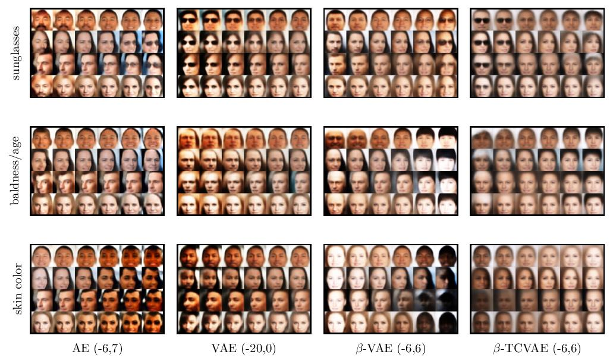

# Overview of Variational Autoencoder-based Generative Models



This is an article about using variational autoencoders for the generation of new data. It contains the code for training the mentioned models on celeb_a and generating the plots. It was written for a seminar I attended.

tensorflow, tensorflow-probabilty, matplotlib and PIL are required.

## train the models yourself
1. download the celeb_a dataset to ```[PATH TO REPO]/datasets```
2. run this to crop the dataset to 64x64 and save it under ```datasets/cropped```
```shell
sh prepare_data.sh datasets/img_align_celeba/img_align_celeba datasets/cropped/img
```
3. run this to train the models on the cropped dataset, the weights will be saved under ```/models```
```shell
sh train_models.sh datasets/cropped
```

## generate the plots
1. run this to generate a plot of all latent dimensions being traversed with a random image and save it under ```plots/```
```shell
sh explore_model.sh datasets/cropped/img ./plots models/my_model
```
2. modify ```example_config.json``` to fit your trained models, you can determine the feature dimensions by looking at the plot generated in the previous step
3. run this to generate the plots and save them under ```plots/```
```shell
sh generate_plots.sh datasets/cropped/img ./plots ./my_config.json
```

## sources
- [An Introduction to Variational Autoencoders](https://arxiv.org/abs/1906.02691)
- [beta-VAE: Learning Basic Visual Concepts with a Constrained Variational Framework](https://openreview.net/forum?id=Sy2fzU9gl)
- [Isolating Sources of Disentanglement in VAEs](https://arxiv.org/abs/1802.04942)

for more information see the references in the report
